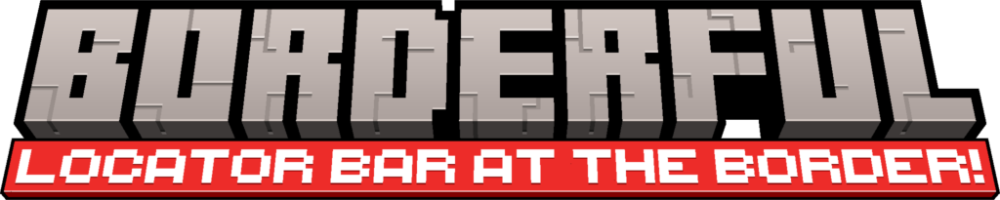

<b>Borderful</b> is a client-side Minecraft mod that moves player waypoint indicators from the locator bar to the edge of your screen. Keep the XP bar visible while staying aware of players and your waypoints around you.

  

---

## What Borderful does

Borderful takes the waypoint information Minecraft normally shows on the locator bar and renders it around the edges of your screen instead. The vanilla locator bar is hidden while Borderful is enabled, but the XP bar and other HUD elements remain available.

Indicators point toward players and custom waypoints that are outside your view. When an indicator is focused, it can move farther inward and grow in size. Optional labels can show its name and distance.

## Features

- **Off-screen player indicators** — see the direction of players tracked by Minecraft's waypoint system.
- **Custom waypoints** — create named markers with editable coordinates and colors.
- **Per-server and per-world waypoints** — custom markers are kept separate between multiplayer servers and singleplayer worlds.
- **Focus and labels** — choose how a marker is focused, adjust its size, and show its name or distance.
- **Player faces and colors** — use player skins for player markers, set team-based colors, or configure individual player overrides.
- **Compass directions** — optionally show cardinal and intercardinal directions around the screen.
- **XP bar stays visible** — Borderful replaces the locator-bar display rather than removing the whole contextual HUD bar.

## Creating a custom waypoint

1. Join a server or load a singleplayer world.
2. Press **B** to open the **Add Waypoint** form. You can change this key in **Options → Controls → Key Binds → Miscellaneous** under **Create Waypoint**.
3. Enter a name. The coordinates start at your current block position; edit them if needed.
4. Pick a color from the selector, type a six-digit hex color, or press **Randomize**.
5. Choose **Done** to save the waypoint for the current server or world.

The existing **Quick add waypoint at current position** keybind is also available in Controls, but it is unassigned by default. Assign it if you want a one-press waypoint without opening the form.

Custom waypoint entries can also be managed in the **Custom Waypoints** configuration category. You can change their name, coordinates, color, or enabled state there.

## Configuration

Open Borderful's configuration from the Mods menu (Mod Menu on Fabric, or the mod configuration button on NeoForge). Available options include:

- **General** — enable or disable Borderful.
- **Waypoint** — adjust the screen-edge inset, marker colors, arrows, player-face rendering, focus behavior, and labels.
- **Custom Waypoints** — edit your named markers.
- **Overrides** — change how individual players are colored, focused, or hidden.
- **Miscellaneous** — configure the compass, force nearby waypoint indicators when the server disables the locator bar, and toggle animations.

Some settings depend on the server providing Minecraft waypoint information. **Force Waypoints** can show nearby players even when the locator bar is disabled, but it cannot reveal players outside the game's available tracking/distance range.

## Installation and compatibility

Use the jar that matches both your Minecraft version and mod loader. The Fabric and NeoForge jars are separate; there is no single universal jar.

| Minecraft version | Fabric | NeoForge |
| --- | :---: | :---: |
| 1.21.6 | Yes | Yes |
| 1.21.9 | Yes | Yes |
| 1.21.11 | Yes | Yes |
| 26.1 | Yes | Yes |
| 26.2 | Yes | Yes |

Install the matching jar in your Minecraft `mods` folder along with the appropriate loader. On Fabric, use Mod Menu if you want to open the config screen from the Mods menu.

## Updating from Locator Border

Borderful was previously named **Locator Border**. On first launch, if `config/borderful.json` does not already exist, the mod copies settings from `config/locator-border.json` to the new config file. Existing custom waypoints without a server/world association are assigned to the first server or world you join after updating.

## Compatibility notes

Borderful changes the client HUD only; it does not add waypoints to the server or change what the server tracks. Other client mods that replace or heavily modify the locator bar/HUD may conflict.

Related mods:

- [Locator Lodestones](https://modrinth.com/mod/locator_lodestones)
- [Death Locator](https://modrinth.com/mod/death-locator-bar)
